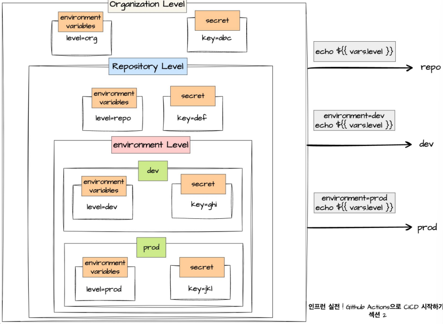

# GitHub Actions의 다양한 기능

- Checkout

  - GitHub Repository를 가져와서 작업을 수행한다.
  - GitHub Marketplace에 정의된 공식 액션이다.
  - Repository 내용을 CICD 워크플로우에서 사용할 때 이용한다.

- Context

  - 워크플로우를 실행하는 환경에 대한 정보이다.
  - Context는 더 유연한 워크플로우를 만들기 위해 사용한다.
    - ex) GitHub Context를 사용해서 조건 설정
      - dev branch에 push 이벤트가 발생하면 workflow에서 1번 job 실행
      - master branch에 push 이벤트가 발생하면 workflow에서 2번 job 실행

- Filter

  - 이벤트가 특정 조건에 부합하면 워크플로우를 실행시키고자 할 때 사용한다.
  - 워크플로우 실행을 더 효과적으로 제어할 수 있다.
  - 종류
    - branch
      - 특정 브랜치에서 실행
      - ex) dev, master branch 중에서 master branch로 push 해야만 실행
    - path
      - 특정 경로에서 실행
      - ex) my-app이라는 디렉토리 내에 있는 파일이 업데이트될 때만 실행
    - tag
      - 특정 태그에서 실행
        - Git에서 태그는 `git tag <tag-name>` 명령어를 이용해서 사용 가능하다.
      - ex) v1.0.0으로 태깅해야 실행
      - tag filter는 push event에서만 사용할 수 있다.

- Timeout

  - 특정 시간 이상 실행되면 자동으로 워크플로우가 중단된다.
  - 특정 job이나 step이 무한 루프를 도는 걸 막아 불필요한 자원 소모를 방지하는 것이 목적이다.
  - default: 360분
  - Timeout은 job level, step level에 설정할 수 있다.
  - `timeout-minutes` 키워드를 사용한다.

- Cache

  - 자주 사용되는 데이터를 빠르게 불러올 수 있도록 저장하는 기능이다.
  - 의존성 설치 시간을 단축할 수 있다.
  - GitHub Marketplace에 정의된 공식 액션이다.

- Artifact

  - 워크플로우 실행 중 생성된 파일 또는 파일 모음이다.
  - 동일한 워크플로우 내에서 job 사이에 데이터를 공유할 수 있다.
  - 워크플로우가 종료된 후에도 데이터가 90일 동안 유지된다.
  - Artifact는 다운로드할 수 있다.
  - `upload-artifact`, `download-artifact`

- Output

  - 한 job에서 생성된 데이터이다.
  - 동일한 job의 step, 다른 job과 데이터를 공유할 수 있다.
    - 여러 step과 job 간에 데이터를 손쉽게 전달할 수 있다.
  - `echo "{key}={value}" >> $GITHUB_OUTPUT`
    - ex) `echo name=github-actions >> $GITHUB_OUTPUT`
  - Output을 사용하려면 Output이 정의된 step의 고유 id를 사용해야 한다.
    ```yaml
    jobs:
      create_output:
        runs-on: ubuntu-latest
        steps:
          - name: echo output
            id: check-output
            run: |
              echo "test=hello" >> "$GITHUT_OUTPUT"
          - name: echo output
            id: check-output-2
            run: |
              echo "test=hello2" >> "$GITHUT_OUTPUT"
          - name: check output
            run: |
              echo ${{ steps.check-output.outputs.test }}
              echo ${{ steps.check-output-2.outputs.test }}
    ```
  - 다른 job에서 output을 사용하려면 needs 키워드와 job level output을 사용하면 된다.

- Artifact vs. Output

  - Artifact
    - 파일 또는 파일 모음으로 데이터를 공유할 수 있다.
  - Output
    - 단순한 값을 전달할 때 사용한다.
    - key-value 형태로 데이터를 저장한다.

- Environment variables

  - step이나 job에서 사용할 수 있는 환경변수이다.
  - key-value 형태로 데이터를 저장한다.
  - 구성 방법

    - env 사용 (워크플로우 내에서 정의)

      - workflow level
      - job level
      - step level
      - 우선순위: step >> job >> workflow
      - `echo "{key}={value}" >> $GITHUB_ENV`, `${{ env.key }}`

        ```yaml
        name: env level
        on: workflow_dispatch
        # workflow level env
        env:
          level: workflow

        jobs:
          get-env-1:
            runs-on: ubuntu-latest
            steps:
              - name: check env
                run: echo "LEVEL ${{ env.level }}

        get-env-2:
          runs-on: ubuntu-latest
          # job level env
          env:
            level: job
          steps:
            - name: check env
              run: echo "LEVEL ${{ env.level }}

        get-env-3:
          runs-on: ubuntu-latest
          env:
            level: job
          steps:
            - name: check env
              run: echo "LEVEL ${{ env.level }}
              # step level env
              env:
                level: step
        ```

    - 미리 정의 (워크플로우 밖에서 정의)
      - 미리 환경변수를 정의한 후에 `${{ vars.<environment-variables> }}`
      - 정의된 환경변수를 바꾸면 워크플로우 결과가 달라질 수 있다.

- Output vs. Environment variables

  - output: 같은 job 또는 다른 job 간에 데이터를 공유할 때 사용한다.
  - env: 동일한 job에서만 데이터를 공유할 때 사용한다.

- Secret

  - 민감한 데이터를 코드와 분리하여 안전하게 저장하고 외부로 노출되는 것을 방지하면서 워크플로우에서 사용할 때 쓴다.
  - ex) API key, 암호, 인증 토큰
  - 특징
    - 안전한 저장
      - GitHub에서 안전하게 암호화한다.
    - 로깅 방지
      - 로그에 기록되지 않고, 출력 시 마스킹 처리된다.
    - 접근 제한
      - 워크플로우 실행 중에만 접근할 수 있다.
  - 정의된 Secret 값을 바꾸면 워크플로우 결과가 달라질 수 있다.
  - `${{ secrets.<secret-name> }}`

- environment

  - 특정 환경에서만 사용 가능한 환경변수와 Secret을 관리할 수 있다.
  - Repository에서 정의할 수 있다.

- Environment variable과 Secret의 level

  - organization level
  - repository level
  - environment level
    
  - 우선 순위
    - environment >> repo >> org

- Matrix

  - 변수 기반으로 여러 job을 실행하는 기능이다.
  - Matrix를 사용해서 하나의 잡을 구성하면 여러 개의 잡을 실행하도록 할 수 있다.
  - `job.strategy.matrix.<변수명>`, `${{ matrix.<변수명> }}`

  ```yaml
  jobs:
    test:
      runs-on: ubuntu-latest
      strategy:
        matrix:
          version: [3.7, 3.8, 3.9]
      steps:
        - name: checkout
          uses: actions/checkout@v3
        - name: setup python
          uses: actions/setup-python@v4
          with:
            python-version: ${{ matrix.version }}
        - name: run python
          run: python script.py
  ```

  ```yaml
  jobs:
    get-matrix:
      strategy:
        matrix:
          # 3 X 3 -> 총 9개의 job 실행
          os: [macos-latest, windows-latest, ubuntu-latest]
          version: [12, 14, 16]
      runs-on: ${{ matrix.os }}
      steps:
        - name: echo matrix value
          run: |
            echo ${{ matrix.os }}
            echo ${{ matrix.version }}
  ```

- If condition

  - 특정 조건이 충족될 때 실행되도록 할 때 사용한다.
  - ex
    - `if: github.event_name == 'push'`
      - push일 때만 실행된다.
    - `if: github.event_name != 'push'`
      - push가 아닐 때 실행된다.
  - level
    - job level: job 실행 여부
    - step level: step 실행 여부
  - `if: always()`를 사용하면 특정 job이나 step을 강제로 실행할 수 있다.

- Filter vs. If condition

  - filter
    - workflow 트리거를 더 세밀하게 제어한다. (branch, path, tag)
  - If condition
    - workflow가 트리거된 이후 job과 step을 세밀하게 제어한다.

- 문자열 처리 함수

  - 문자열에 대한 조건 검사를 수행하고 job 또는 step의 실행 여부를 결정한다.
  - 종류
    - startswith( searchString, searchValue )
    - endswith( searchString, searchValue )
    - contains( search, item )

- Concurrency
  - 워크플로우 실행의 동시성을 제어한다.
  - 배포 워크플로우가 여러 개 동시에 실행되는 경우 중복 실행을 방지한다.
  - group
    - 서로 충돌하지 않게 작업하려는 작업 그룹을 식별하는 문자열이다.
    - 두 개의 워크플로우 실행이 동일한 group 값이라면 concurrency 설정에 따라 관리한다.
  - cancel-in-progress
    - 동일한 그룹에 속한 새 워크플로우가 시작될 때 아직 실행 중인 워크플로우를 취소할 지 여부를 결정한다.
  - level
    - workflow level
    - job level
